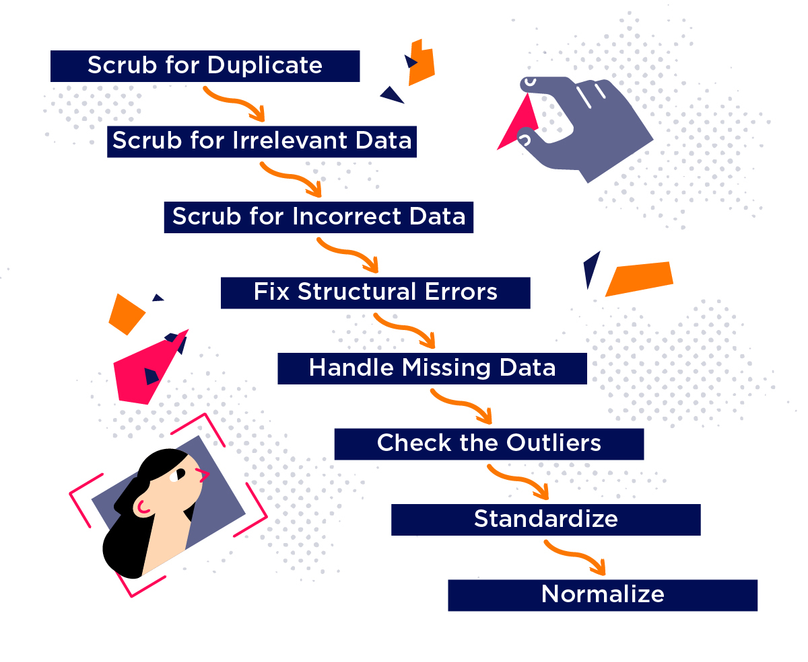

# niftyAnalysis2
<h2>Sample Exercise on Data Cleaning using Pyspark on Stock Market dataset</h2>

About: 
The NIFTY 50 is a benchmark Indian stock market index that represents the weighted average of 50 of the largest Indian companies listed on the National Stock Exchange.

<b>Data cleaning</b> is the process of fixing or removing incorrect, corrupted, incorrectly formatted, duplicate, or incomplete data within a dataset. When combining multiple data sources, there are many opportunities for data to be duplicated or mislabeled. If data is incorrect, outcomes and algorithms are unreliable, even though they may look correct. There is no one absolute way to prescribe the exact steps in the data cleaning process because the processes will vary from dataset to dataset. But it is crucial to establish a template for your data cleaning process so you know you are doing it the right way every time. 

Tools Used: 
-VSCode [IDE]

Libaries & Frameworks Used: 
-Pyspark 
-Pandas

